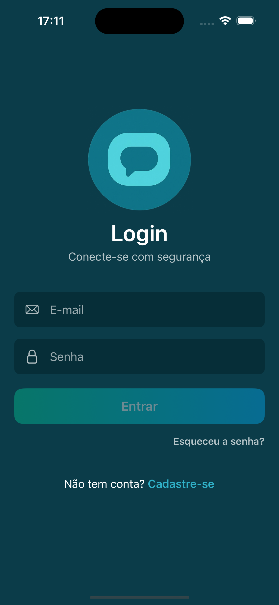
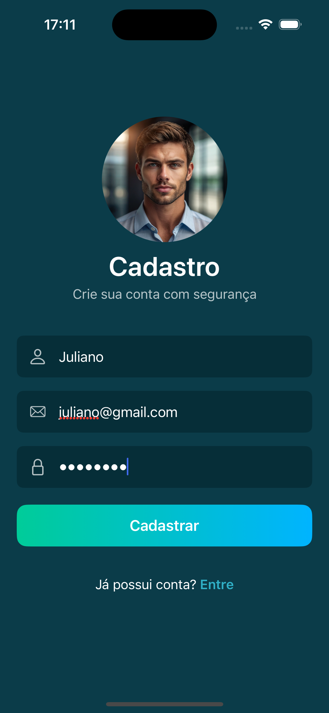
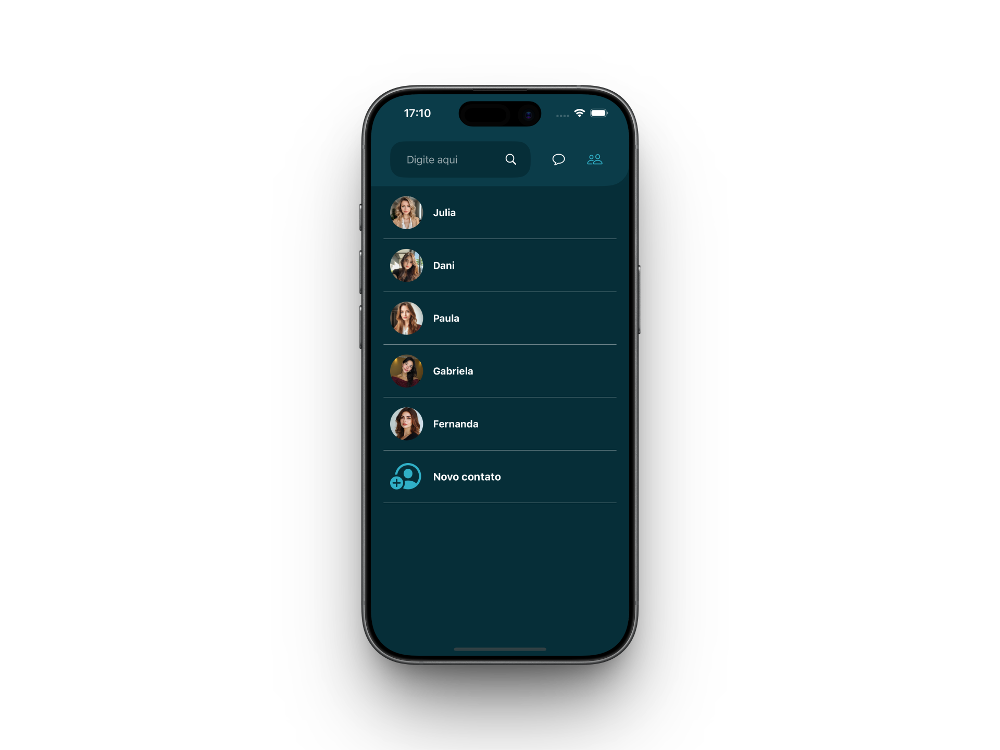
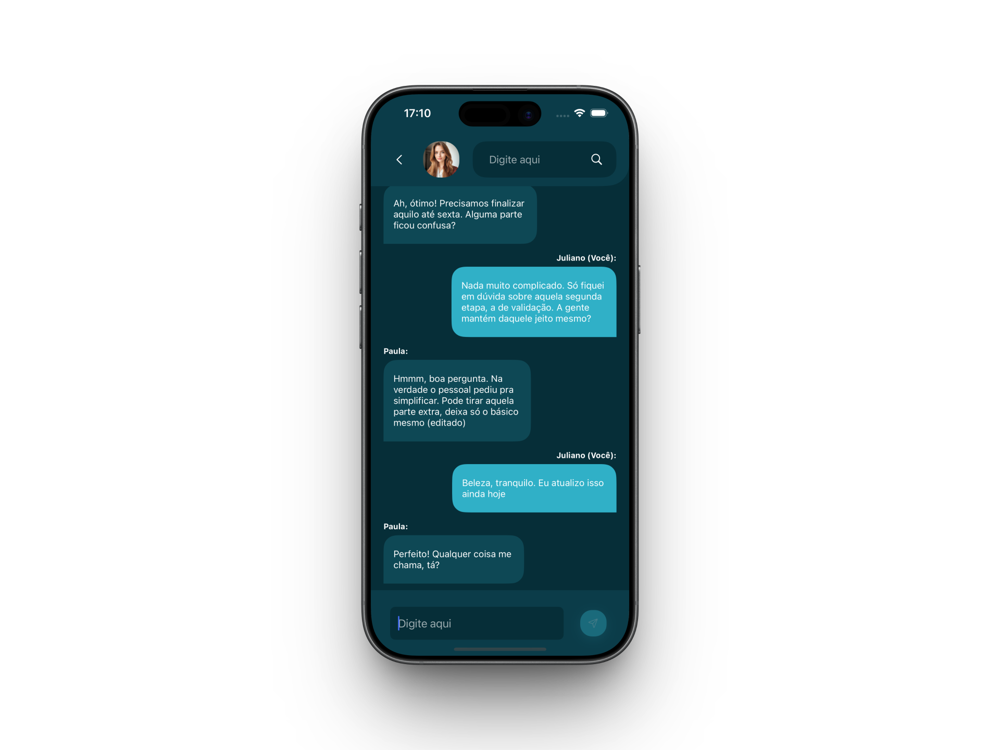

# 💬 ConnectChat

Aplicativo iOS de mensagens em tempo real, desenvolvido como projeto final da disciplina de Webservices e MBaaS.

## 🖼️ Screenshots

<p align="center">
  
  
  
  
  
</p>

## 📱 Sobre o Projeto

ConnectChat permite que usuários se autentiquem, cadastrem contatos e conversem em tempo real. O app foi construído com UIKit utilizando layouts programáticos, integrações com os serviços da Firebase e oferece recursos pensados para um fluxo de mensagens moderno, como edição e exclusão de mensagens enviadas.

## ✨ Funcionalidades

  - Autenticação por e-mail e senha com Firebase Authentication
  - Cadastro de usuários com upload de foto de perfil
  - Lista de conversas com última mensagem atualizada em tempo real
  - Gerenciamento de contatos com busca por e-mail e prevenção de duplicidade
  - Conversas em tempo real com Cloud Firestore e sincronização bidirecional
  - Edição e exclusão de mensagens via gestos de swipe
  - Destaque visual para mensagens editadas e identificação do remetente
  - Carregamento de avatares com cache local e integração ao Firebase Storage

- 💾 **Persistência de Dados**
  - Cloud Firestore para armazenamento de conversas e contatos
  - Firebase Storage para imagens de perfil
  - Firebase Authentication para gerenciamento seguro de usuários

## 🛠️ Tecnologias Utilizadas

- **Swift** – Linguagem de programação principal
- **UIKit** – Construção de interface e navegação programática
- **Auto Layout** – Layout responsivo via código
- **Firebase Authentication** – Login e gerenciamento de usuários
- **Cloud Firestore** – Persistência em nuvem em tempo real
- **Firebase Storage** – Upload e distribuição de imagens de perfil
- **Swift Package Manager** – Gestão das dependências Firebase
- **URLSession & NSCache** – Download e cache manual de imagens remotas

## 🚀 Como Executar

### Pré-requisitos

- Xcode 16.0 ou superior
- macOS Sonoma 14.5 ou superior
- Simulador ou dispositivo com iOS 18.0+
- Conta Firebase com um projeto iOS configurado

### Passos

1. Clone o repositório

```bash
git clone https://github.com/julianosgarbossa/ConnectChat.git
```

2. Abra o projeto no Xcode

```bash
open ConnectChat/ConnectChat.xcodeproj
```

3. Atualize o arquivo `ConnectChat/GoogleService-Info.plist` com as credenciais do seu projeto Firebase (ou substitua pelo arquivo fornecido pelo assistente do Firebase)

4. Aguarde o download das dependências via Swift Package Manager

5. Selecione um simulador ou dispositivo físico e rode o projeto (`⌘ + R`)


